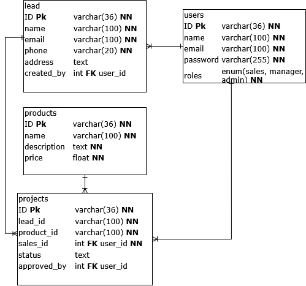
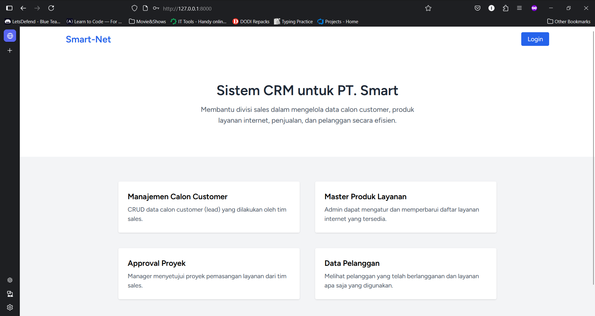
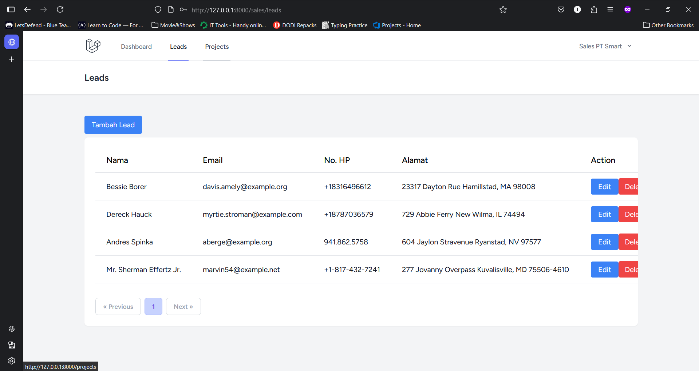
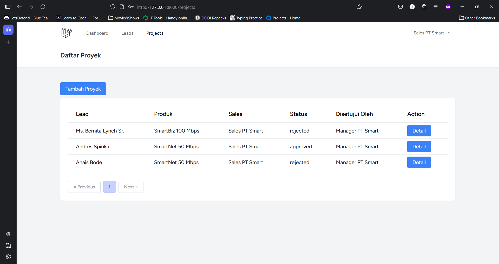
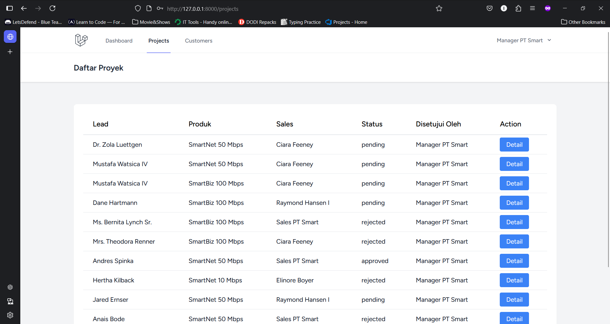
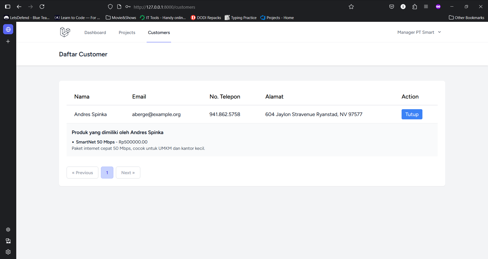
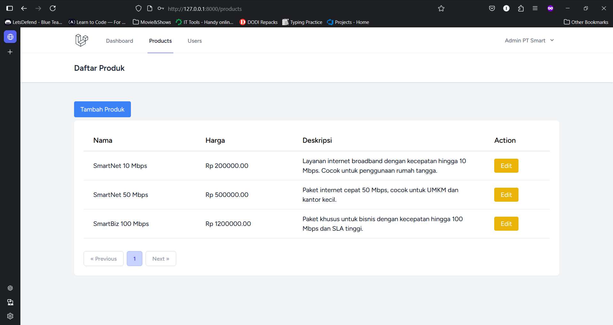
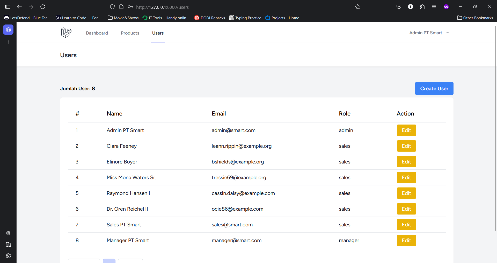

# CRM Website - PT Smart

Website berbasis Laravel 11 yang dibuat untuk mengatur data pelanggan perusahaan ISP (Internet Service Provider) PT Smart.

## 👤 Author

**Lalu Immaratul Ardhi Ganeru**

## 🔐 Credential Login

### Admin
Email: admin@smart.com\
password: password

### Manager
Email: manager@smart.com
password: password

### Sales
Email: sales@smart.com\
password: password

## 📌 Deskripsi Proyek
Sistem ini dirancang untuk mengelola calon pelanggan (leads), layanan/produk, dan proyek-proyek layanan internet yang diusulkan oleh tim sales. Setiap user memiliki role tertentu yang memengaruhi hak akses dan fitur yang tersedia.

## 🧩 Fitur Berdasarkan Role

### 🔐 Admin
- Manajemen pengguna (Create, Read, Update, Delete)
- Manajemen produk/layanan (Create, Read, Update, Delete)

### 🧑‍💼 Manager
- Melihat daftar proyek
- Menyetujui atau menolak pengajuan proyek dari sales

### 💼 Sales
- Menambahkan calon pelanggan (lead)
- Mengajukan proyek layanan berdasarkan lead


### 🗄️ Database Diagram



## 🛠️ Teknologi yang Digunakan
- Laravel 11
- Inertia.js (React)
- PostgreSQL
- Tailwind CSS
- Laravel Breeze (autentikasi)
- Role management manual (tanpa package eksternal)

## 🚀 Cara Menjalankan
1. Clone repositori:
   ```bash
   git clone https://github.com/your-username/project-crm-smart.git
   cd project-crm-smart
   
2. Install dependency backend:
   ```bash
   composer install
   
3. install dependency frontend:
   ```bash
   npm install
   
4. Setup file .env dan konfigurasi database
   ```bash
   cp .env.example .env
   php artisan key:generate

5. Jalankan migrasi dan seeder
   ```bash
   php artisan migrate --seed

6. Jalankan server
   ```bash
   php artisan serve
   npm run dev
   
## Halaman

### Landing Page


### Leads (Sales)


### Projects (Sales)


### Projects (Manager Approval)


### Customers (Manager)


### Produk (Admin)


### Manajemen User (Admin)

